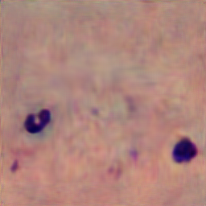

# malaria_detection_generation

This code repository contains 2 independet tools. 
1. Classification of malaria plasmoids in microscopy images using convolutional neural networks. 
2. Generation of microscopy images using Generative Adversial Networks. 
More specifically, we focus on Giemsa staining of malaria plasmoids. 

This code is reffered to the article 
~~~~ 
@article{Ramarolahy2020blood,
  title={Classification and Generation of
 Microscopy Images with Plasmodium Falciparum  via Artificial Neural Networks},
  author={Ramarolahy, R  and Opoku, E and Crimi, A},
  journal={ },
  volume={},
  number={},
  pages={},
  year={},
  publisher={Elsevier}
}
~~~~

******************************************************************************************************************
1. Classification of microscopy images

The code is further subdivided into two parts:  training and testing model &  detection of parasites on an image (automated detection).

In this code we used two datasets.
-The first data contains individual cells from https://ceb.nlm.nih.gov/repositories/malaria-datasets/.
-The second contains thick smear image from http://air.ug/microscopy/.

We created a CNN model and decided to train on both datasets.
If you want to train by yourself, make sure that you have the datasets, and you can decide which data should you train. 
You can run *main.py* in the terminal and add the directory of the data that you want to train.
For example: *python3 main.py './cell_images'* 
In this case, you decided to train the individual cells datasets.
For this first dataset, it will be better if you use GPU. If you don't have, you can use google COLAB like I did.
For the use of COLAB, you need to have the data of the individual cells i.e train, test, validation. 
So you need to find a way to run the function data_preparation() inside Data_Ind_cells.py and save the data in your drive.
If you got the data, then you can connect your drive to COLAB and run 'Training_ind_cells.ipynb'.

For the second part, the detection, you need an image of either thick nor thin blood smear and run the appropriate code. Make sure that you have the model before running the code.
To run this code, you need to put the model and the image like, for example: *python3 thin_evaluation.py models/CNN_ind_cells.h5 '2a_002.JPG'* 

For thick_evaluation.py, if you do not have the annotated data (.xml), you can comment line 86-95.

These codes were written usig tensorflow 2.1.0
NB: -You need some image of thin smear and thick smear for the second part of the code. For thick smear, you can use the data itself.
For thin smear, you can try this https://drive.google.com/drive/folders/1EMJ7dg0TBs34sDWcj7Tj1wozXJC0wtbc

*********************************************************************************************************************
 2. Generation of microscopy images using Generative Adversial Networks. 

The idea is to run a GAN architecture with minimal data available

  

This second part of the code code uses Tensorflow 2.1.0 and Tensorlayer 2.2
